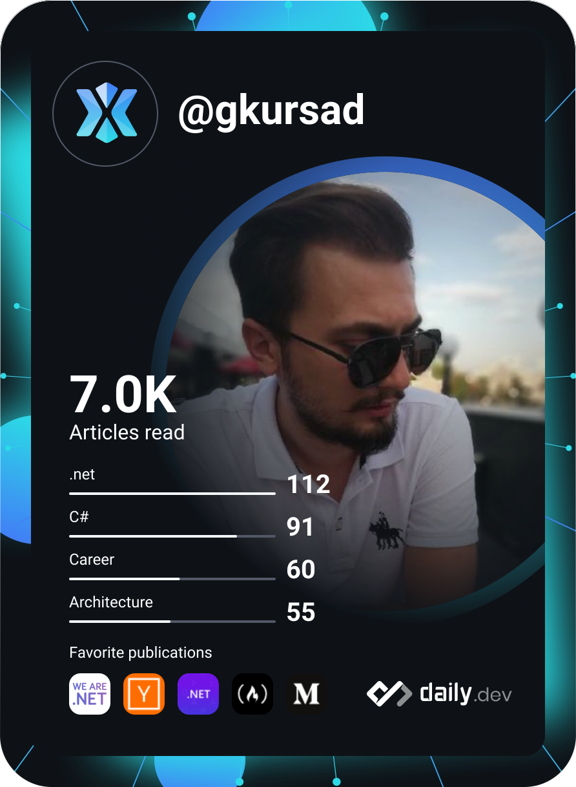

 

 

## 👋 Hakkımda

16 yıldır kurumsal yazılım geliştiriyorum. Serbest geliştiricilikle başlayan yolculuğum; ERP, adisyon ve mezbaha otomasyonlarından mobil uygulamalara, araç kiralama platformundan e-Dönüşüm ürünlerine uzandı.

Bugün **Nilvera**'da yazılım geliştirme ve teknik destek ekiplerinin başındayım. e-Dönüşüm ürünlerinin planlama, geliştirme ve teslim süreçlerini yönetiyor, ölçeklenebilir SaaS çözümlerinin mimari temelini oluşturuyorum.

 

## ⚡ Hızlı Bakış

| | |
| --- | --- |
| 🧑‍💼 **Rol** | Head of Software Development & Technical Support, Nilvera Yazılım |
| 🕰️ **Deneyim** | 16+ yıl kurumsal yazılım geliştirme |
| 🎯 **Odak** | Yazılım mimarisi, teknik borç yönetimi, ekip liderliği |
| 🧰 **Ana Yığın** | C#, .NET, MSSQL, Clean Architecture |
| 📍 **Konum** | Kayseri, Türkiye |

 

## 🛠️ Teknik Yetkinlikler

| Alan | Teknolojiler |
| ---- | ------------ |
| **Backend** |   `ASP.NET` `Entity Framework` `Clean Architecture` |
| **Veri** |    |
| **Dağıtık Sistemler** |  `Mikroservis` `Memcached` |
| **DevOps** |     |
| **Web & Masaüstü** | `Blazor` `Razor` `DevExpress` |
| **Ağ & Güvenlik** |  `CCNA` `CyberOps` `Network Security` |

 

## 🧭 Nasıl Çalışırım

- 🏗️ **Mimari:** Clean Architecture ve modüler tasarımla teknik borcu yönetilebilir tutmak
- 🔄 **Modernizasyon:** Legacy .NET Framework projelerini modern .NET ve Code First mimarisine taşıma
- ⚙️ **Engineering Governance:** `.editorconfig` ve katı linting kurallarını "guardrail" olarak kullanıp teknik borcu kaynağında önlemek
- 🤝 **Ekip kültürü:** RFC süreçleri, iç teknik sunumlar, pair programming, mentorluk ve blameless post-mortem

 

## 📈 Kariyer

| Dönem | Rol | Kurum |
| ----- | --- | ----- |
| 2026 - Halen | Head of Software Development & Technical Support | Nilvera Yazılım |
| 2023 - 2025 | Senior Software Engineer | obilet.com |
| 2023 - 2024 | Lead .NET Developer (Danışman / Team Lead) | İNDİS Yazılım |
| 2022 - 2023 | Chief Software Engineer | Kilim Mobilya |
| 2019 - 2021 | Senior Software Engineer | Joker Yazılım |
| 2010 - 2019 | Yazılım Geliştirici / Bilgisayar Mühendisi | Serbest, Kursoft, Safa Bilişim |

 

## 🎯 Öne Çıkan Çalışmalar

- **Nilvera:** Yazılım geliştirme ve teknik destek ekiplerini yönetiyor; code review, teknik borç analizi ve API güvenliği süreçlerini ölçüyorum.
- **obilet.com:** Araç kiralama ürününün uçtan uca geliştirilmesini sağladım; arama sayfası optimizasyonu, veritabanı indexleme ve bakım, sunucu ve performans yönetimini yürüttüm.
- **İNDİS Yazılım:** Broker projesinin geliştirilmesinden sorumlu oldum; ekibi yönetip performans, veritabanı yapıları ve hata giderme süreçlerini yürüttüm.

 

## 🎓 Eğitim ve Sertifikalar

- **Yüksek Lisans (devam ediyor):** Bilgisayar Mühendisliği, Erciyes Üniversitesi · Tez: *Hibrit Derin Öğrenme Teknikleri Kullanarak Nesne Boyutu Hesaplama*
- **Lisans:** Bilgisayar Mühendisliği, Erciyes Üniversitesi
- **Sertifikalar:** Cisco Networking Academy (CCNA modülleri, CyberOps Associate, Cybersecurity Essentials ve diğerleri)

 

🏍️ **Mesai dışı:** Chopper tutkusu ve uzun yollar.

 

  

*"Clean code always looks like it was written by someone who cares." — Robert C. Martin*

